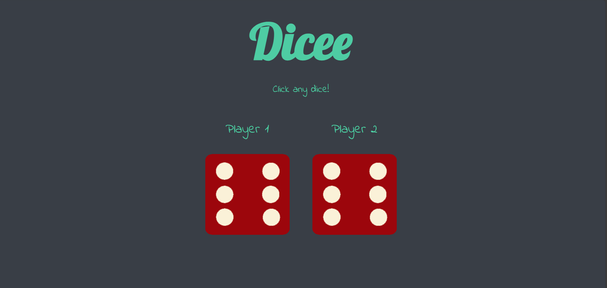
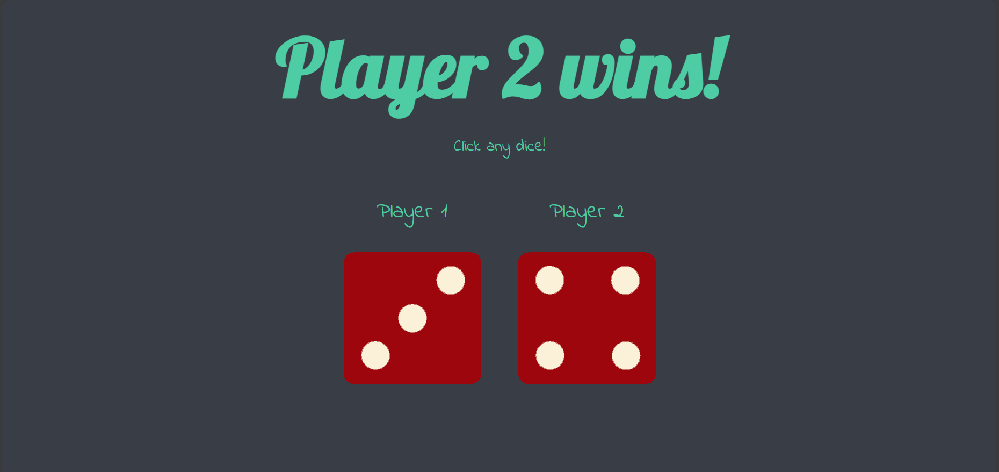

### Dicee Game
Dicee Game is a simple web-based game where two dice are rolled, and the player with the greater number wins the game. It's a fun and luck-based game that you can play anytime to test your luck!

### Hosted Link
[Link](https://arpitbaheti2002.github.io/Dicee-html-game/)

### Screenshots

### How to Play
1. Open the Game: Launch the dicee.html file in your web browser.
2. Roll the Dice: Click on any dice to roll the dice for both players.
3. Winning: The player with the greater number on the dice wins the game.
4. Play Again: To play another round, simply roll the dice again.

### Technologies Used
+ HTML: Used for structuring the web page.
+ CSS: Used for styling the user interface and layout.
+ JavaScript: Used for game logic and dice rolling functionality.
